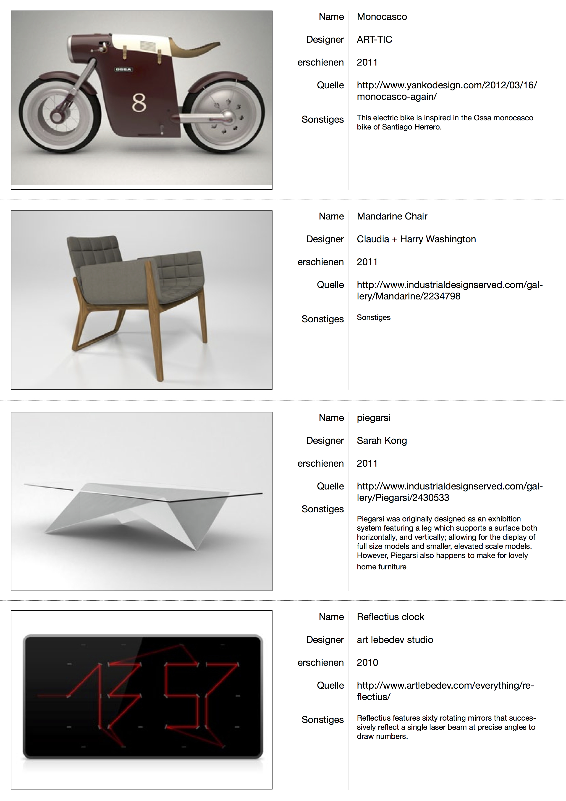

## Einleitung

### Designforschung 

### Interview mit Prof. Jörg Hundertpfund / Dipl. Des. Christof Flötotto 

## Analyse

### Methodik Design Radar

In meinen Augen ist die Methodik eine spielerische und schöne Art sich mit Designobjekten und der Suche nach Designtendenzen zu beschäftigen. Den Anfang macht die Suche nach den Objekten. Dies kann in der Regel alles sein. Jedoch ist es einfacher, sich anfangs auf Produktdesign zu beschränken, da sich hierbei der Großteil aller Funktionen eines Objektes von einem Foto aus erschließen lässt. Anders als es beispielsweise bei Software oder Web Design wäre, wo ein Großteil der Funktionen, erst durch Interaktion mit dem Objekt (in diesem Falle Applikation oder Website) begriffen werden können.

#### Das Objekt

Das Objekt wird mit einem Bild und einigen wenigen Parametern  beschrieben. Die Parameter enthalten die Informationen Name, Designer, Erscheinungsjahr, Quelle und einen Freitext. Hierzu dient momentan ein InDesign-Dokument als Vorlage um die Objekte zu katalogisieren und in eine einheitliche Form zu bringen. Ist eine kritische Masse erreicht, druckt man die gesammelten Objekte aus, verteil sie auch einer grossen Fläche und beginnt die Suche nach Ähnlichkeiten, die ein Cluster bilden können.

#### Der Cluster

Der Cluster soll in seiner vollendeten Form eine Tendenz, oder Strömung im Design repräsentieren. Zu erst jedoch dient er uns als Sammlung von Objekten mit augenscheinlichen Ähnlichkeiten. Auch hier gilt es eine kritische Masse an Objekten in dieser Sammlung zu haben, ehe man anfängt sich eine Definition des Clusters zu überlegen. Die Vorlage für das Cluster verlangt eine strukturierte Beschreibung, die durch ihre Stränge dem Nutzer aber auch hilft, das Cluster besser kennenzulernen, zu überdenken und zu definieren. Unter den Punkten _Merkmal, Konzept, Methode und Kritik_ finden wir 15 Unterpunkte, die der genauen Beschreibung des Designphänomens, das dieser Cluster präsentiert, dienen soll.

Der Prozess der Cluster Bildung ist ein fließender. Die Interaktion mit den Objekten, wie sortieren, arrangieren und erneut betrachten, empfinde ich als inspirierend und unterhaltsam. Die Ausformulierung der Beschreibung ist hingegen schwieriger und verlangt eine genaue Betrachtung und Hinterfragung der Objekte.  

Sehr begrüssend finde ich auch die kollaborative Arbeit bei dieser Methode. Es ist schön in den Objekten eines Kollegen eines zu entdecken, welches perfekt ins eigene Cluster passt. Ebenso die automatisch entstehenden Diskussionen, sind motivierend und sorgen für ein regelmäßiges Auftauchen aus dem eigenen Tunnelblick. 

### Werkzeug Design Radar

Das Werkzeug basiert derzeit auf einer Wordpress Installation, was durchaus ein guter Anfang ist, nach meiner Meinung jedoch auf lange Sicht, mehr Nach-, als Vorteile mit sich bringt. Ich denke, es eignet sich gut zum Befüllen einer Datenbank mit Designobjekten, die Vorkonfektioniertheit des Wordpress Frameworks schränkt aber die kreative Umsetzung von Werkzeugen, wie dem Design Radar, stark ein. Jegliche Interaktion fühlt sich sehr _bloggig_ an. 

#### Die Eingabe

Was am für mich anfangs sehr verwirrend war, ist der Umstand, dass der User eigentlich im Front End arbeiten soll. Die Entscheidung ist für mich nachvollziehbar, da das Wordpress Back End zu viele Optionen anbietet, als dass man damit schnell und einfach Objekte einpflegen könnte, und das Layout eines Wordpress Back Ends ändern möchte man eigentlich auch nicht, wenn es nicht unbedingt sein muss. Deshalb muss man zuerst auf das Front End wechseln, wenn man sich in den Design Radar eingeloggt hat.

Der User landet auf der _Objects_ Ansicht. Es gibt hier die Möglichkeit sich alle Objekte des Design Radars anzuschauen. An der Seite haben wir Filter Optionen. Unter dem Menüpunkt _Cluster_ Kann sich der User alle Cluster des Design Radar anzeigen lassen und unter _MyRadar_ kann der User seine eigenen Objekte und Cluster verwalten und neu erstellen.

##### Objekt
Die Eingabemaske verlangt eine Fülle von Parameter, die ich der Vollständigkeit halber im Glossar unter Objekt aufliste. Sehr Praktisch ist, dass dem Benutzer für einige Felder (u.a. Farben, Designer, Material) ein Katalog zur Verfügung steht, aus dem er schon gelistetes auswählen kann. Dies stellt sich einem Auto-Complete-Drop-Down-Menu dar. Besondere Beachtung verdienen die beiden semantischen Differentiale. Unter den Punkten _Räumlich physikalische Wirkung_ und _Assoziative Wirkung_ finden wir einmal 8 und einmal 16 Extrempaare, zwischen denen wir, mithilfe eines Schiebereglers auf einer 5er-Skala, differenzieren können. Unüblich, aber möglich, ist die Option keine Angaben zu machen. In diesem Fall wird das betreffende Extrempaar ausgegraut. Insgesamt kann der Design Radar User Angaben zu 35 Parametern machen.

##### Cluster
Wenn ich einen neuen Cluster erstellt habe, sind erst einmal alle Objekte in Ihm enthalten (Big Bug!!!). Das ändert sich erst, wenn ich andernorts ein Objekt meinem Cluster hinzugefügt habe. Das geht unter der Ansicht _Objects_ und wird unter dem nachfolgenden Punkt beschrieben. Grob kann man den Cluster in drei Bereiche einteilen: die _Objekte_, den generativen Teil _Auffälligkeiten_ und den editorial Teil. Die _Objekte_ werden durch das ihnen eigene Bild repräsentiert, durch einen Klick darauf gelangt man zur Objektanzeige. Der Bereich _Auffälligkeiten_ generiert sich durch die Parameter der hinzugefügten Objekte. Leider werden nur die Parameter _Designer, Materialeigenschaften, Farbpalette und Assoziative Tags_ in Betracht gezogen. Der editorial Teil führt die Punkte auf, die wir schon von der InDesign Vorlage her kennen.

#### Die Verwaltung
Sehr wordpress-typisch mutet die Verwaltung der Objekte an. In einem Raster werden die Objekte durch ihre Fotos repräsentiert. Wenn der User mit der Maus über ein Objekt fährt, erhält er die Möglichkeit durch einen Klick auf den entsprechenden Knopf, das Objekt zu editieren, was soviel heißt, dass er in die vorher beschriebene Eingabemaske zurückkehrt und Parameter verändert oder vervollständigt. Um nach Clustern zu suchen, hat der Benutzer die Möglichkeit, Objekte anhand von 4 Parametern (Herstellungszeitraum, Form, Material, Tags) zu filtern. Die verbleibenden Objekte kann er dann zu einem seiner Cluster hinzufügen.  

#### Die Ausgabe
Es gibt derzeit keine wirklich gestaltete Ausgabe aus dem Werkzeug heraus. Man kann sich alle Objekte und Cluster anschauen, allerdings unterscheidet sich diese Darstellung nicht großartig von der Eingabemaske. Der letzte Stand der Dinge ist, dass die gesammelten Erkenntnisse und Objekte des Clusters in die bereits erwähnte InDesign-Vorlage übertragen und so als Poster ausgedruckt werden.

Anders als bei der analogen Methodik ist man hier sehr allein mit seinen Objekten, Clustern und den dahinter stehenden Überlegungen. Der spielerische Aspekt geht, aufgrund der fehlenden haptischen Repräsentation der Objekte, verloren. Eine Arrangement der Objekte nach eigener Vorstellung ist in der aktuellen Konfiguration nicht möglich. Hingegen werden leider auch nicht die Vorzüge des digitalen Mediums genutzt. Beispielsweise finden die semantischen Differentiale keine Erwähnung im Cluster, was in Hinsicht auf die Menge der dort abgefragt Parameter sehr schade ist.

### Andere Ansätze

Mir liegt nichts daran, den Design Radar in seiner jetzigen Konfiguration schlecht zu reden. Das Werkzeug wurde gebaut, um einen Anfang zu haben und dieser Aufgabe wird es auch gerecht. Mittlerweile hat sich aber auch so einiges getan, in Hinblick auf Web-Technologien im Allgemeinen und Plattformen, die ähnliches tun wie der Design Radar, im Besonderen.

Dieser Abschnitt stellt einige Social Networks vor, die ich als inspirierend für das Redesign des Design Radars ansehe. 

#### Tumblr

Tumblr begeistert mich durch seine Einfachheit. Man ist schnell angemeldet und bereit digitale Fundstücke zu veröffentlichen. Als User verfügt man über Werkzeuge, die das Posten und das Verfolgen des eigenen Feeds vereinfachen. So gibt es für die drei wichtigsten mobilen Plattformen (iOS, Android und Windows Phone) Applikationen, die das eigene Dashboard auf das Smartphone, bzw. Tablet, holen und für Desktop Browser eine Bookmarklet, dass das Posten direkt von der Quelle ermöglicht.

Wird ein Post erstellt, hat der User die Möglichkeit, diesen zu taggen. Nach diesen Tags kann gesucht werden, einzeln, aber auch nach mehreren. Somit hat man die Möglichkeit, gezielt nach Einträgen zu suchen und diese auch zu filtern.

Die Desktop Version der Website erlaubt es dem User, seinen Feed per Keyboard zu steuern, was das rebloggen und favorisieren von Posts vereinfacht und beschleunigt. Tumblr verfügt zudem über eine gut ausgebaute und dokumentierte API, die es erlaubt, selbst Applikationen zu schreiben. So kann ein Feed, sei es der eigene, der eines anderen Users oder die Suche nach einem oder mehreren Tags abgefragt werden. Das Ergebnis kann dann bspw. in eine Homepage eingebettet werden.

#### Pinterest

Wie auch bei Tumblr folgt man anderen Usern oder postet, repostet oder favorisiert Einträge. Was Pinterest von Tumblr in der Interaktion unterscheidet, sind die Pinboards. Das sind Sammlungen von, hier Pins genannten, Einträgen. Beim Erstellen solcher Pinnwände wird nach einer Kategorie und einem Beschreibungstext gefragt. Man kann auch explizit einer bestimmten Pinnwand folgen. 

Der Feed ist durch sein mehrspaltiges Layout wesentlich komplexer als bei Tumblr, was mir nur halbgut gefällt. Einerseits sorgt es für einen größeren Überblick, anderseits leidet die Übersichtlichkeit darunter sehr. Ein nettes Feature zeigt sich, wenn es zu Übertragungslatenzen kommt und die Bilder der Pins nicht schnell genug dargestellt werden können. Pinterest ersetzt sie kurzzeitig durch ein Farbfeld, dass dem Mittelwert des Fotos entspricht. Bei der Applikation für das Smartphone bekommt man ein schön gestaltetes und funktionales Menü, wenn man einen Pin gedruckt hält, welches die selben Möglichkeiten bietet, wie das Hover-Menü im Desktopbrowser. 

Interessant ist auch, dass Pinterest sehr schnell überprüfen kann, ob schon etwas zuvor gepostet wurde. Poste ich beispielsweise ein Bild, das schon in der Pinterest Datenbank gespeichert ist, so wird mir sogleich nach Abschluss meines Post gezeigt, auf welchem Pinboard es ebenfalls zu finden ist. So werde ich auch wieder auf neue Pinboards und User aufmerksam, denen ich dann ebenfalls folgen kann und die meinen Feed noch erlebnisreicher machen.

Ähnlich wie bei Tumblr, bekommt der User ein Werkzeug zur Verfügung gestellt, um Pins direkt an ihrer Quelle zu erstellen, ohne zur Pinterest Seite wechseln zu müssen. Statt einem Bookmarklet ist es hier eine Browser-Erweiterung und natürlich die Applikationen für mobile Geräte. 

Dazu kommt noch, dass auf vielen Internetseiten schon ein Pinterest Button eingebaut ist, der das Pinnen, der dort veröffentlichten Inhalte zusätzlich vereinfacht. Dieses letzte Feature bietet Tumblr auch an, wir jedoch nicht nicht sooft bedient, wie das von Pinterest.

 
#### Poutsch

Poutsch ist der jüngste Service und bietet die Möglichkeit, sich eine Meinung einzuholen, bzw. abzugeben. Und das wirklich sehr simpel! Man meldet sich an und schon hat man einen Feed voll mit Fragen, durch die man sich durchklicken kann. Besonders auf einem mobilen Gerät funktioniert die Abgabe der eigenen Meinung sehr flüssig. Sehr schön ist es auch, dass man sofort den bisherigen Trend erhält, so bald man zu einem Thema geantwortet hat.

Poutsch gibt ein gutes Beispiel, dass Umfragen nicht weh tun müssen und wie man die Meinungen von bis zu Tausenden erreicht. Das funktioniert meiner Meinung nach durch die Einfachheit des Interfaces, und dass es immer nur eine Frage, mit einem mehr oder weniger aussagekräftigen Bild, ist. 

Die Idee dahinter finde ich sehr gut, ob es sich auf lange Zeit durchsetzen wird, sei dahin gestellt. Auch wenn es wirklich schön und simpel gestaltet ist, fesseln die Fragen nicht so sehr, wie die Bilder in einem Pinterest oder Tumblr Feed. Das hängt auch an der Qualität der Fragen. Die derzeit auf Poutsche gestellten, sind leider oft vom Kreationismus oder Konsum getrieben („Do you believe in God?” oder „IPhone 5s vs HTC one vs Samsung Galaxy S4?”).
Zu Testzwecken habe ich dem Netzwerk eine Frage gestellt und bin sehr gespannt, wie viele User ihre Meinung dazu abgeben.

### Ein kurzes Fazit

 

## These
### Design Radar ist Bilder & Metadaten 
### Design Radar ist ein Ökosystem / Social Network!
### Design Radar ist multiscreen!!
### Design Radar ist touchy!!!

## Methode

## Anhang

### Literaturverzeichnis

### Impressum

### Eidesstattliche Erklärung
